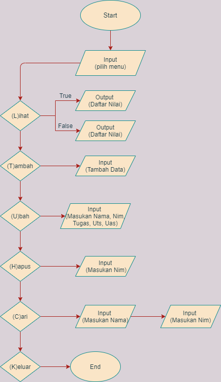
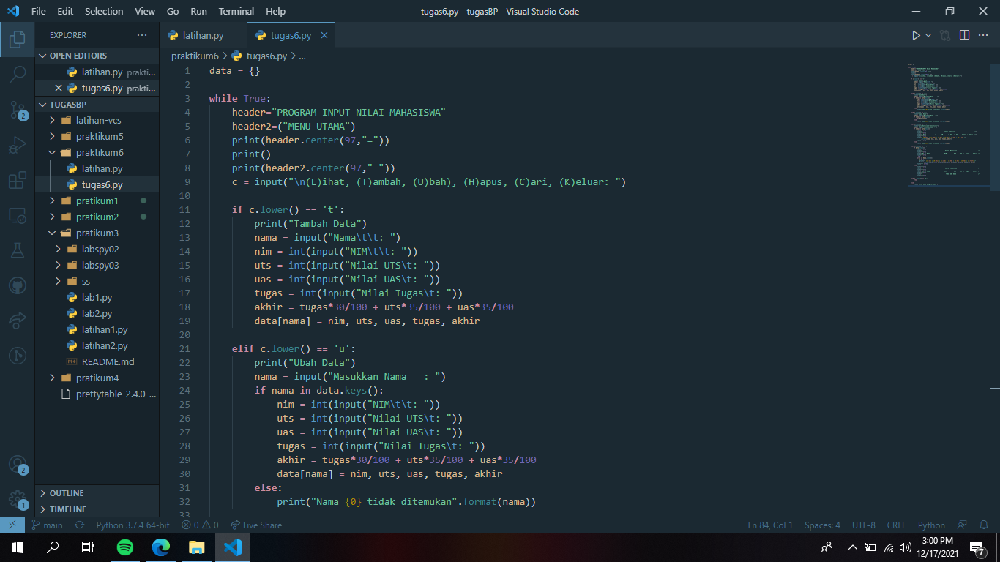
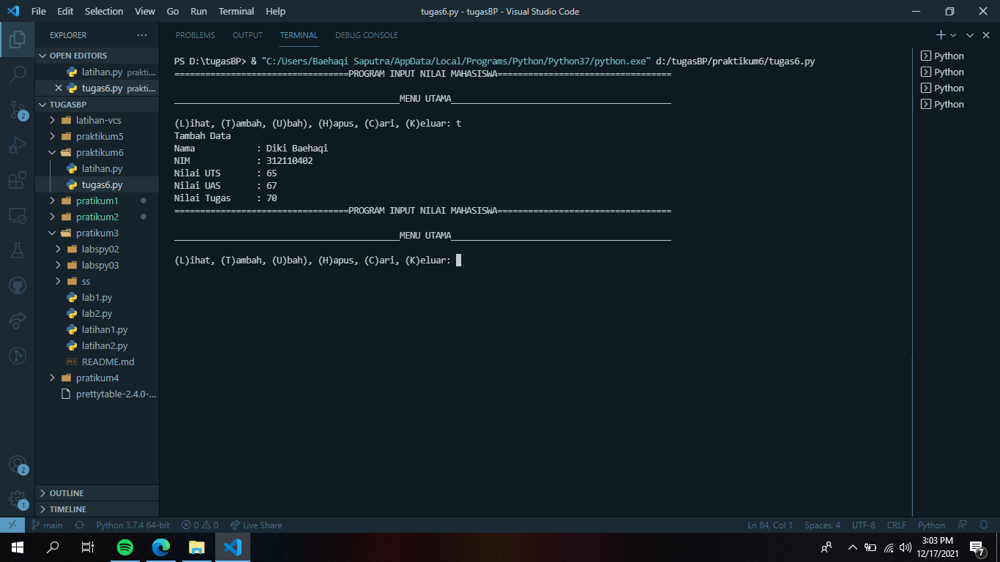
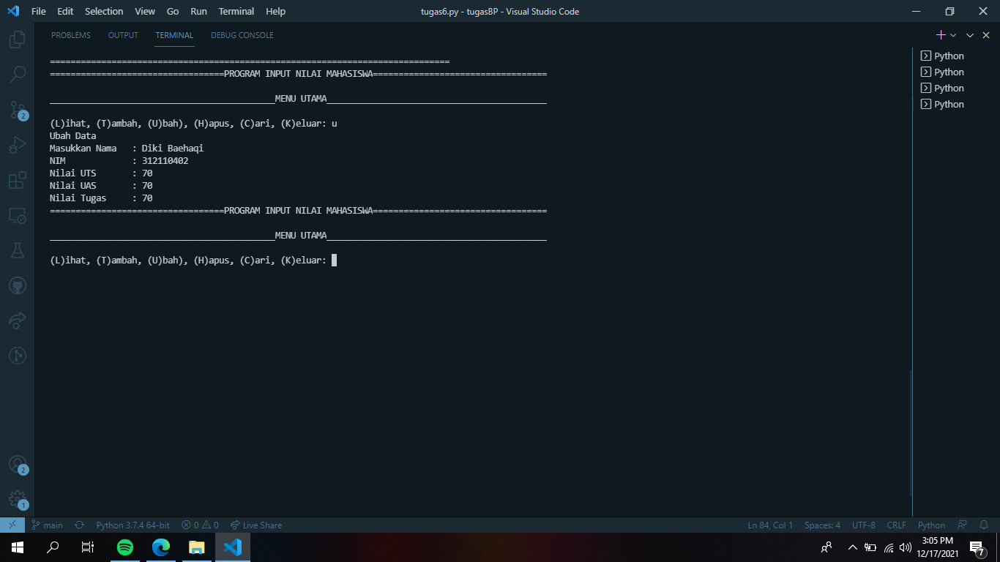
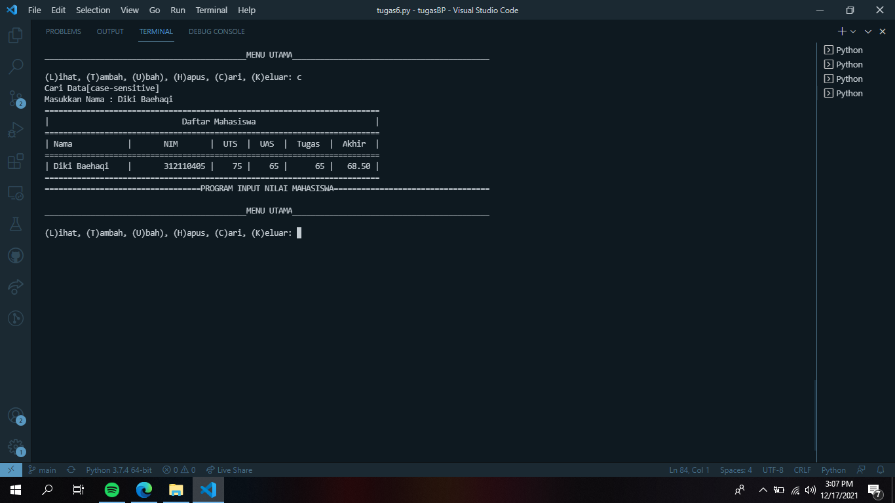
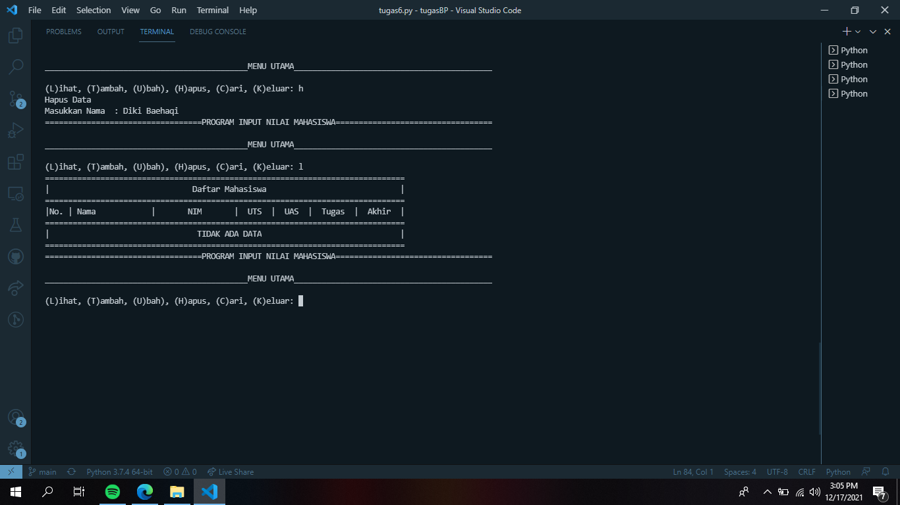
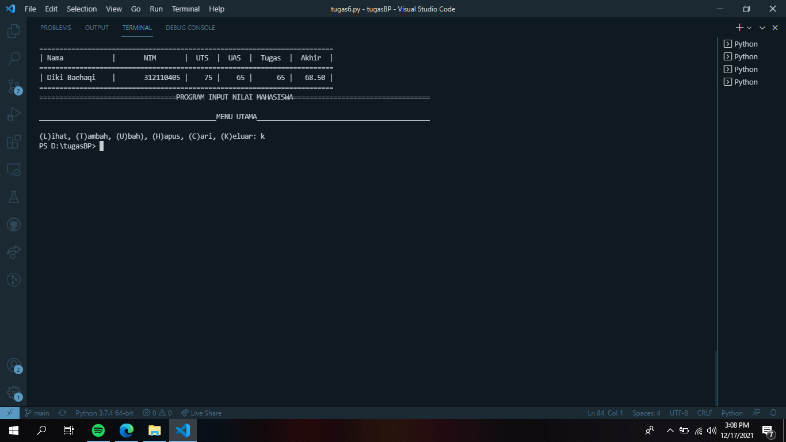

# Praktikum6
## Input data mahasiswa menggunakan bahasa python

### Profil
Nama : Diki Baehaqi

Nim : 312110402

Kelas : TI.C1.21

### flowchart dari input data mahasiswa
Membuat Program Sederhana Menampilkan Daftar Nilai Mahasiswa Dengan Ketentuan Sebagai Berikut :
Program dibuat dengan Fungsi
menampilkan menu pilihan:

Tambah data

Tampilkan data

Hapus Data

Ubah data

Cari Data

### source code program python menggunakan Fungsi

### menu Output tambah data

### menu Output ubah data

### menu Output cari data

### menu Output hapus data

### menu Output Keluar program

TERIMAKASIH
